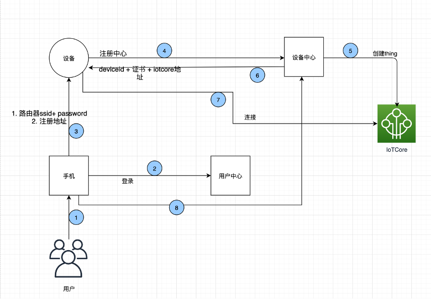
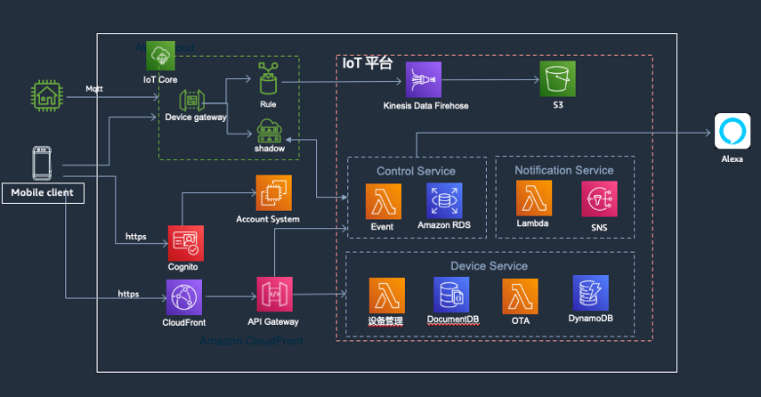

当客户购买设备回家，第一件事就是配网，
所以配网是所有物理网公司和客户建立Link的第一步， 
我们来看看如何在亚马逊云上构建设备配网。
Blog:https://aws.amazon.com/cn/blogs/china/smart-home-iot-platform-module-distribution-network/

**配网流程**

**架构图**

API调用流程图

**1.打包**
安装配置 AWS CLI

**2.安装**
参考 AWS 命令行界面 安装
Win 下载 https://s3.amazonaws.com/aws-cli/AWSCLI64.msi 安装
Mac/Linux 执行 npm install awscli (首先初始化 node)

**3.配置 AWS CLI**
aws configure
输入 AWS Access Key ID  = （aws子账户id）
AWS Secret Access Key = （aws子账户密钥）
region name = ap-southeast-1（region ）

**4.创建s3 储存通**
aws s3 mb s3://cloudconfig-mydemo-app --region ap-southeast-1
进入项目根目录

**5.本地打包**
mvn package

**6.cloudformation打包**
aws cloudformation package --template-file sam.yaml --output-template-file output-sam.yaml --s3-bucket cloudconfig-mydemo-app

**7.部署lambda函数**
aws cloudformation deploy --template-file output-sam.yaml --stack-name cloudconfig-mydemo-app  --capabilities CAPABILITY_NAMED_IAM --region=ap-southeast-1

**8. 获取应用信息**
aws cloudformation describe-stacks --stack-name cloudconfig-mydemo-app --region=ap-southeast-1

